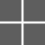

  Olá sou o Henrique, tenho 19 anos, sou estudante de Análise e Desenvolvimento de Sistemas na Fatec Rubens Lara - Santos/SP.

  Comecei a programar com 16 anos quando entrei para o curso técnico de Desenvolvimento de Sistemas na ETEC Doutora Ruth Cardoso - São Vicente/SP, desde lá não paro de estudar     programação.

  Sou extremamente apaixonado por React Native e sempre estou aberto a aprender novas tecnologias.

  📚 Conhecimentos: 
   
   -
   -
   -
   -
   -
   -
   -
   -
   -
   

  🛠️ Ferramentas: 
   
   -
   -
   -
   -
   

  📖 Estudando atualmente: 
    
    -
    -
   

 
  ❤️ Minha lib:
   
 
   

---

   

 

---

<h2>Contato:</h2>

   -
   -
 

